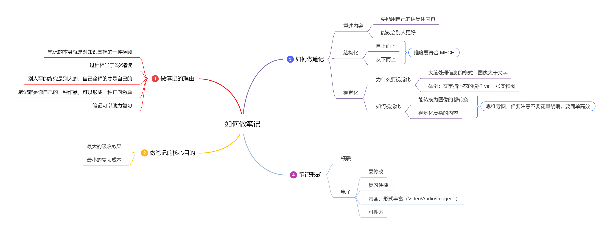

## 前言

阅读 [这或许是最牛逼的做笔记的方法！](https://zhuanlan.zhihu.com/p/158405703) 笔记

> 做事情之前先想好，做这件事的目的是什么？想明白本质是什么！所以开篇先问自己一些问题

写这篇笔记的目的是什么？

答：

1. 自己偶尔也会写一些笔记，但是效果似乎不是太好，无法坚持或者没有回顾，并没有得到想要的效果；希望通过这么一篇文章来加强这方面的效果，学会做笔记。
2. 实践一下这篇文章中提到的方法，是否行之有效！

所以为了达到上述目的，需要做哪些事情？

1. 不要流于形式！自己做事情总是容易走入旁枝末节导致主任务无法有效完成；比如：放弃格式、形式的追求；先完成文字内容部分，再去考虑其他的细节
2. 要尽量用自己的话总结归纳，不要摘抄或者复制！

## 目的

阅读的目的是什么？

**记忆、理解、吸收知识**

经常读完一个东西觉得自己好像都懂了，但是让你立马复述文章、书本的思想或者内容；发现大脑却是一片空白。让自己的阅读变成了白读了

那么如何防止自己遗忘、不理解、没能吸收知识？如何避免？

**理解、复习、多次阅读**

通过哪些手段来打成上述目标？答曰：做笔记，做笔记的理由？

- 笔记的本身就是对掌握的一种检阅
- 做笔记的过程 = 二次精读
- 别人写的东西终究是别人的，只有你重新诠释才是你的
- 笔记就是你的作品，有作品的读书会形成正向激励
- 笔记可以助力快速复习

## 如何做笔记

做笔记的核心目的是什么？

- 最大的吸收效果
- 最小的复习成本

一切其他做笔记形式上的东西不能脱离这两条，否则都是无意义的

做笔记的三原则

- 重述内容
- 结构化
- 视觉化

### 重述内容

1. **要能用自己的话去复述你阅读过的内容**，现在信息如此繁杂，每天阅读了巨量的信息，可以并没有留下来；用心的去理解并用自己的话去表达出来
2. 要是能把你学到的东西教会别人那更好；学习有几种层次，具体不太清楚了，记得最顶层就是说可以教会别人；那么你就是真的掌握了

> 感慨：突然想起高中的时候,总是有同学问自己问题，以为会浪费自己的时间去教会别人，那个时候还觉得亏了；实际上教会别人的途中你会不断发现自己对知识点
理解盲区，实际上这是一个双赢的过程。

### 结构化

这里结构化的好处不再赘述，是个人都能理解它的好处（这里作者举了一个记忆数字的例子，一个没有规律，一个有规律），认知心理学已经证明：大脑喜欢有
规律的东西，没有逻辑的东西直接往大脑里灌是反人性的。

重点讲一下如何结构化：

- 自上而下
- 从下而上层层归纳

这里光看这个文字可能没有一点用，可以说是大道理；那么举几个例子说明一下

假设我们想知道水果有多少种？一股脑我们几乎列不出几个

自上而下的：

- 水果
    + 有果核
        - 多水分
            + 桔子、丰水梨、葡萄等...
        - 少水分
            + 枣子...
    + 无果核
        - 多水分
            + 西瓜、哈密瓜...
        - 少水分
            + 香蕉...

那么从下而上的，就是反过来；多水分的、少水分的，然后有核的、无核的等...

从上面我们发现结构化的时候，最需要的是找到他们的维度，而且可以找到多种维度；例如刚刚的水果的例子，我们还可以从

- 季节
- 颜色
- 口感
- 价格
- ...

来进行结构化，这里介绍一个 MECE 法则

MECE(Mutually Exclusive Collectively Exhaustive 相互独立、完全穷尽)即分类要：不重叠、不遗漏，这里举例说明符合和不符合 MECE 的例子

- 符合 MECE
    + 人类分成：男人、女人
    + 人类分成：成年人、未成年人
- 不符合 MECE
    + 人类分成：老人、小孩（有遗漏：成年人、青年等不包括在里面）
    + 人类分成：男人、女人、小孩（有重复，小孩里可能有男有女反之亦然）

所以当你审查使用什么维度时要去确保符合 MECE，确保你的结构没有遗漏

通过上面的原则，我们构建知识的结构：找出大主题，大主题下的小主题，小主题的论点、论据，小主题之间的联系等，这样就够化之后知识就清晰了

> 这里作者推荐一本书《金字塔原理》

### 视觉化

#### 为什么要视觉化？

- 论点：大脑处理图像的速度远大于文字
- 论据：生物书上对风信子的文字描述 vs 一张风信子的图片

#### 如何视觉化

三步：

- 能转换成图像的都转换成图像
    + 论点：《刻意练习》中作者使用了大量的篇幅来描写刻意练习最佳适用场景
    + 论据：用了一个圈圈图（三个套在一起的圈，看完之后还是没能理解 -_-||）
- 视觉化复杂的内容
    + 论点：《刻意练习》中关于刻意练习的构成流程的可视化
    + 论据：用一个简单的三角图把问题描述清楚了
- 思维导图
    + 思维导图本身就具有：重述+结构化+视觉化的效果
    + 论点：思维导图具备上面的三个要素
    + 论据：给了一张思维导图做说明
    + 但是要注意一个原则：不要花里胡哨，以时间最短、效率最高为准

## 其他

### 纸质笔记 VS 电子笔记

具体不赘述：选**电子笔记**就对了，大概就是：

- 易修改
- 复习便捷
- 内容、形式丰富（图片、视频、音频等...）
- 可搜索

